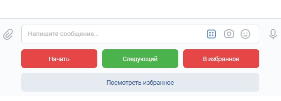
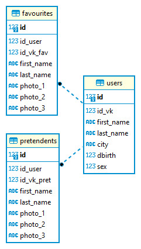

# Командный проект по курсу «Профессиональная работа с Python»

## VKinder

### Исправили замечания: 
- программа теперь не прекращает работу, если мы нажимаем кнопки "Следующий", "В избранное", "Посмотреть избранное", при незаполненных таблицах в БД.
- параметры подключения к БД вынесли в отдельный файл key_bd.py

Прекращение работы программы, которое у вас возникло в момент поиска претендентов, из нас ни у кого не было. Пока мы это прокомментировать не можем. 

Программа-бот VKinder взаимодействует c базами данных VK. Бот предлагает пользователю различные варианты претендентов для знакомства в социальной сети Вконтакте. Взаимодействие с ботом выполнено в виде диалога.

На основании информации о пользователе из VK выполняется поиск претендентов, подходящих под условия:

- год рождения
- пол
- город

У подходящих претендентов выбираются самые популярные фотографии.

Информация в чате выводится в формате :
- ФИО
- ссылка на страницу
- ссылки на  3 популярных фото

Управление осуществляется с помощью кнопок.

Вся информация по пользователям, претендентам и избранным хранится в базе данных.

### Используемые библиотеки и СУБД
- vk_api
- SQLAlchemy
- PosgreSQL

### Структура модулей
- models.py - описан класс для создания БД
- vk_user.py - процедуры для работы с VK
- funck_for_BD.py - процедуры для работы с БД
- app.py - описание работы чат-бота
- token_for_vk.py - размещены токены VK
- key_bd.py - размещены параметры подключения к БД

#### Бот запускается из файла app.py.
#### Но предварительно: 
- вставьте свои ключи в файл token_for_vk.py, 
- заполните параметры подключения к БД в файле key_bd.py
- в модуле funck_for_BD.py раскомментируйте функцию create_tables для создания/пересоздания таблиц в БД.

### Этапы работы с чат-ботом:

1. Для начала работы с чат-ботом нужно написать ему "Привет": уже на этом этапе чат-бот  записывает в БД(USers) всю необходимую информацию по польователю и  запускает поиск всех претендентов по основным трем критериям и записывает их в БД(Pretendets).
2. Пользователь получает ответ от чат-бота ""Привет, {user_name}! Мы хотим помочь тебе найти вторую половинку, нажми Начать"). 
3. После нажатия кнопки "Начать" пользователю отправляется информация по претенденту: ФИО, ссылка на страницу, ссылки на  3 популярных фото.
4. Для перехода к следующему претенденту нужно нажать на кнопку "Следующий" и так далее можно просматривать остальных.
5. Для добавления претендента в избранное нужно нажать на кнопку "В избранное" - эти претенденты записываются в БД(Favourites). Чтобы просмотреть всех избранных нужно нажать на кнопку "Посмотреть избранное"- данные выгружаются из БД. В режиме просмотра избранных также можно листать список.
   

